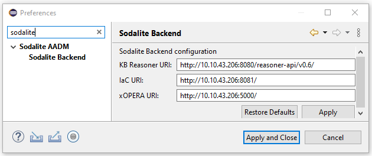
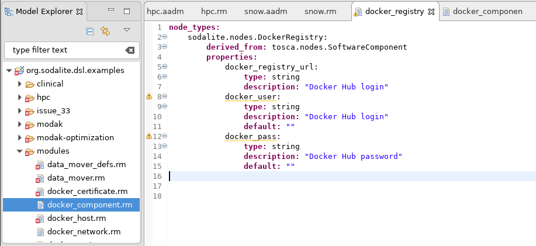

[](https://www.sodalite.eu/)
# IaC platform stack
 
Implementation of the blueprint and integration tests for the SODALITE platform stack

SODALITE uses IaC, namely the well known Topology and Orchestration Specification for Cloud Applications [TOSCA](https://www.oasis-open.org/committees/tc_home.php?wg_abbrev=tosca) OASIS standard for modelling the infrastructure and application deployment. The TOSCA lifecycle operation interfaces are implemented in [Ansible](https://www.ansible.com/) playbooks and roles. 
This repository contains two TOSCA/Ansible SODALITE stack deployment blueprints which can be deployed by SODALITE orchestrator [xOpera](https://github.com/xlab-si/xopera-opera). First `service.yaml` blueprint located in `./openstack` folder designed for the SODALITE platform supporting [openstack](https://www.openstack.org/) private cloud deployment. Second one, located in `./docker-local` folder represents a local machine docker setup  (not recommended for real development).

## SODALITE stack contents
Here is the list of SODALITE stack components, with corresponding Docker images that are in fact deployed by blueprints. **Network alias** is used for container cross referencing in internal Docker network. **Container port** indicates the port exposed by Docker container, while **Host port** shows the mapped port that is published on localhost or Openstack VM.


| Name | GitHub repository | Docker Image | Network alias | Container ports | Host ports |
| --- | --- | --- | --- | --- | --- |
|Docker Registry |  |[registry](https://hub.docker.com/_/registry)| registry |443|443|
|SODALITE Reverse Proxy | |[traefik](https://hub.docker.com/_/traefik)| proxy | 5000, 5001, 5002, 5432, 8888 | 5000, 5001, 5002, 5432, 8888 |
|SODALITE Keycloak | |[jboss/keycloak](https://hub.docker.com/r/jboss/keycloak)| keycloak | 8080, 8443 | 8100, 8443 |
|SODALITE Vault | |[vault](https://hub.docker.com/_/vault)| vault | 8200, 8201 | 8200, 8201 |
|Platform Discovery Service |[platform-discovery-service](https://github.com/SODALITE-EU/platform-discovery-service)|[platform-discovery-service](https://hub.docker.com/r/sodaliteh2020/platform-discovery-service)| pds | 8089 | 8081 |
|xOpera REST API |[xopera-rest-api](https://github.com/SODALITE-EU/xopera-rest-api)|[xopera-rest-api](https://hub.docker.com/r/sodaliteh2020/xopera-rest-api)| xopera-rest-api |8080|  |
|Postgres DB for xOpera |  |[postgres](https://hub.docker.com/_/postgres)| xopera-postgres |5432| |
|Swagger UI for xOpera| |[swaggerapi/swagger-ui](https://hub.docker.com/r/swaggerapi/swagger-ui)| xopera-ui |8080|  |
|IaC Blueprint Builder |[iac-blueprint-builder](https://github.com/SODALITE-EU/iac-blueprint-builder)|[iac-blueprint-builder](https://hub.docker.com/r/sodaliteh2020/iac-blueprint-builder)| iac-builder | 80 | 8081 |
|Docker Image Builder REST API |[image-builder](https://github.com/SODALITE-EU/image-builder)|[image-builder-api](https://hub.docker.com/r/sodaliteh2020/image-builder-api)| image-builder-api |5000|  |
|Knowledge Database |[semantic-reasoner](https://github.com/SODALITE-EU/semantic-reasoner)|[graph_db](https://hub.docker.com/r/sodaliteh2020/graph_db)| graph-db |7200|7200|
|Semantic Reasoner API |[semantic-reasoner](https://github.com/SODALITE-EU/semantic-reasoner)|[semantic_web](https://hub.docker.com/r/sodaliteh2020/semantic_web)| semantic-web |8080|8080|
|IaC Metrics Framework API |[iac-quality-framework](https://github.com/SODALITE-EU/iac-quality-framework)|[iacmetrics](https://hub.docker.com/r/sodaliteh2020/iacmetrics)| iac-metrics |5000|5003|
|TOSCA Defect Prediction API |[defect-prediction](https://github.com/SODALITE-EU/defect-prediction)|[toscasmells](https://hub.docker.com/r/sodaliteh2020/toscasmells)| tosca-smells |8080|8082|
|Ansible Defect Prediction API |[defect-prediction](https://github.com/SODALITE-EU/defect-prediction)|[ansiblesmells](https://hub.docker.com/r/sodaliteh2020/ansiblesmells)| ansible-smells |5000|5004|
|TOSCA Syntax Verifier API |[verification](https://github.com/SODALITE-EU/verification)|[toscasynverifier](https://hub.docker.com/r/sodaliteh2020/toscasynverifier)| tosca-syntax |5000|5005|
|Workflow Verifier API|[verification](https://github.com/SODALITE-EU/verification)|[workflowverifier](https://hub.docker.com/r/sodaliteh2020/workflowverifier)| workflow-verifier |5000|5006|
|Rule-based Refactoring API |[refactoring-ml](https://github.com/SODALITE-EU/refactoring-ml)|[rule_based_refactorer](https://hub.docker.com/r/sodaliteh2020/rule_based_refactorer)| rule-based-refactorer |8080|8083|
|Performance Prediction API |[refactoring-ml](https://github.com/SODALITE-EU/refactoring-ml)|[fo_perf_predictor_api](https://hub.docker.com/r/sodaliteh2020/fo_perf_predictor_api)| performance-predictor-refactoring |5000|5007|
|Refactoring Option Discovery API |[refactoring-option-discoverer](https://github.com/SODALITE-EU/refactoring-option-discoverer)|[refactoring_option_discoverer](https://hub.docker.com/r/sodaliteh2020/refactoring_option_discoverer)| refactoring-option-discoverer |8080|8084|
|Skydive Analyzer | |[skydive/skydive](https://hub.docker.com/r/skydive/skydive)| skydive-analyzer |8082|8088|
|Skydive Capture | |[skydive/skydive](https://hub.docker.com/r/skydive/skydive)| skydive-capture | | |
|Prometheus Skydive Connector |[skydive-flow-exporter/prom_sky_con](https://github.com/SODALITE-EU/skydive-flow-exporter/tree/master/prom_sky_con) |[prometheus-skydive-connector](https://hub.docker.com/r/sodaliteh2020/prometheus-skydive-connector)| prometheus-skydive-connector |9100|9101|
|Consul for Monitoring System  | |[consul](https://hub.docker.com/_/consul)| consul |8500, 8600 |8500, 8600 |
|Alert Manager for Monitoring System  | |[prom/alertmanager](https://hub.docker.com/r/prom/alertmanager)| alertmanager |9093|9093|
|Prometheus for Monitoring System  | |[prom/prometheus](https://hub.docker.com/r/prom/prometheus)| prometheus |9090|9090|
|Monitoring System Ruleserver |[monitoring-system/ruleserver](https://github.com/SODALITE-EU/monitoring-system/tree/master/ruleserver)|[monitoring-system-ruleserver](https://hub.docker.com/r/sodaliteh2020/monitoring-system-ruleserver)| ruleserver |9092|9092|
|MODAK Optimiser API |[application-optimisation](https://github.com/SODALITE-EU/application-optimisation)|[modak-api](https://hub.docker.com/r/sodaliteh2020/modak-api)| modak-api |5000|55000|
|MySQL DB for MODAK |[application-optimisation](https://github.com/SODALITE-EU/application-optimisation)|[modak-py3-mysql](https://hub.docker.com/r/sodaliteh2020/modak-py3-mysql)| modak-db |3306|32000|

## SODALITE stack installation
### Input guidelines
- no input should be empty
- password should not have special characters
- [xOpera GIT config](https://github.com/SODALITE-EU/xopera-rest-api#git-backend-server-optional-recommended) 
(url, token) should be real, otherwise xOpera REST API will not start. 
### Ubuntu - local
Clone the repo and run script.
```shell script
git clone https://github.com/SODALITE-EU/iac-platform-stack.git
cd iac-platform-stack
./deploy_local.sh deploy
```
### Ubuntu - openstack
Clone repo and run script. OPENRC_PATH is path to file with env vars for OpenStack connection.
```shell script
git clone https://github.com/SODALITE-EU/iac-platform-stack.git
cd iac-platform-stack
./deploy_openstack.sh undeploy [OPENRC_PATH]
```
### Alternative installation
Preferred method for installation is use of [deploy_local.sh](deploy_local.sh) and [deploy_openstack.sh](deploy_openstack.sh). Alternatively, see [manuall install steps](manual_install.md).

## SODALITE stack configuration
1.  ### Install SODALITE IDE
    SODALITE IDE can be installed either as a Docker container or from source code on GitHub.
    In order to run IDE as a Docker container use the following commands:
    * for Ubuntu
    `docker run --name sodalite-ide -it -d -e DISPLAY=:0 -v /tmp/.X11-unix:/tmp/.X11-unix sodaliteh2020/sodalite-ide`
    * for Windows Docker Desktop installation 
    `docker run --name sodalite-ide -it -d -e DISPLAY=host.docker.internal:0.0 -v /tmp/.X11-unix:/tmp/.X11-unix sodaliteh2020/sodalite-ide`

    *NOTE: SODALITE IDE Docker image uses X11 windowing system. Using Windows for IDE Docker image installation requires an X server (e.g VcXsrv) and additional configuration.*

    To install SODALITE IDE from source code proceed with instructions described here: [SODALITE IDE GitHub](https://github.com/SODALITE-EU/ide). Use **Installation from the Sodalite IDE source code** scenario.

2.  ### Test Semantic Reasoner API
    Send a GET HTTP request to http://localhost:8080/reasoner-api/v0.6/testReasoner. This request will provide information whether Semantic Reasoner and Graph DB are configured correctly and populate Graph DB with basic TOSCA 1.3 normative type definitions.

    For Openstack deployment configuration substitute `localhost` with VM's public IP address.
   
3.  ### Configure SODALITE IDE backend connection
    Proceed with SODALITE IDE configuration as described in the [IDE Tutorial](https://docs.google.com/document/d/1w6wYJbTZvBbt5LD6sXReXbx1uPDjefYFAU5KEv8X_8w/edit)
    *   Open IDE preference page: menu Window/Preferences. 
    *   Search for Sodalite in search text. Click on Sodalite Backend
        
    
        
    * Edit the URI for the Sodalite Backend services: KB Reasoner, IaC Builder and xOPERA.
        In case of local SODALITE stack deployment use: 
      *   http://localhost:8080/reasoner-api/v0.6/ for KB Reasoner  
      *   http://localhost:8081/ for IaC Builder
      *   https://localhost:5001/ for xOPERA

        For Openstack deployment configuration substitute `localhost` with VM's public IP address. 

4. ### Work with Abstract Application Deployment Models (AADM) and Resource Models (RM)
    IDE Docker image already contains some AADM and RM examples that can be found in Model Explorer (Window -> Show View -> Model Explorer)
    

    If IDE is installed from source code, examples can be found [here](https://github.com/SODALITE-EU/ide/tree/master/dsl/org.sodalite.dsl.examples).
    
    Check [IDE Tutorial](https://docs.google.com/document/d/1w6wYJbTZvBbt5LD6sXReXbx1uPDjefYFAU5KEv8X_8w/edit) for details.

NOTE: SODALITE currently uses the version [xOpera version 0.6.4](https://pypi.org/project/opera/0.6.4/) since xOpera is being developed to support [OASIS TOSCA Simple Profile in YAML version 1.3](https://www.oasis-open.org/news/announcements/tosca-simple-profile-in-yaml-v1-3-oasis-standard-published).
